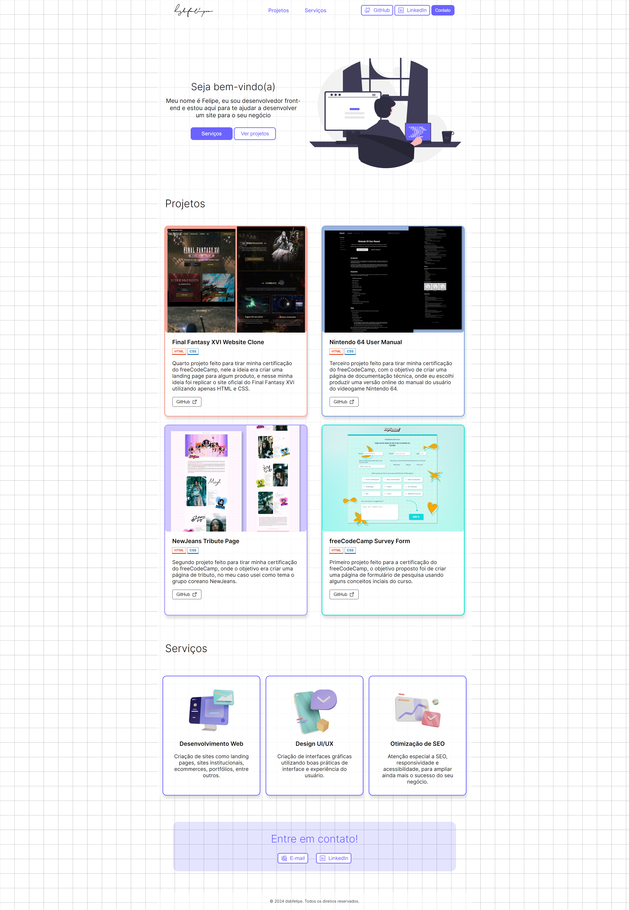

# freeCodeCamp Personal portfolio

 
 

**Certification Project**

Project for _freeCodeCamp_ **Responsive Web Design** course

My personal portfolio page using HTML and CSS

## Project Overview

The objective of this project was to make an app similar to "https://personal-portfolio.freecodecamp.rocks" and passing the test's requirements, practicing what was learned on the last module of the course, like **CSS Animation** and **CSS Transforms**.

 

_
Project's screenshot
_

 

768px screenshot

 

Screenshot for tablet's screen size

 

Mobile screenshot

 

  
Screenshot for smartphone's screen size

 
